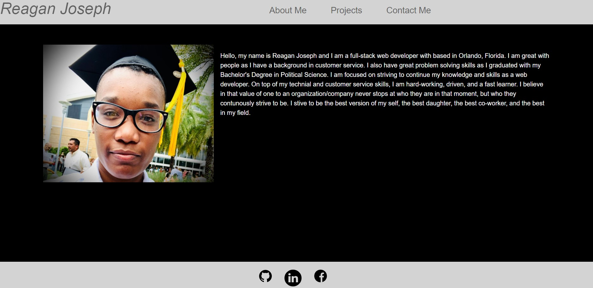

  # My Portfolio 

  ## Description
  My portfolio displaying a introduction to me, my projects so far, and how to reach me.

  ## Table of Contents
  * [Technologies](#installation)
  * [Usage](#usage)
  * [Questions](#questions)
  

  ## Technologies
  My portfolio was built with the help of react, bootstrap, and service workers. 
  

  ## Usage
  Check out my old and recent works posted on github and how to reach out to me. [Click Me](http://reaganjoseph26.github.io/Portfolio)
   
  

  ## Questions
  If you have any additional questions, please reach out to me. 
  You can reachout to me at my GitHub profile, which is [reaganjoseph26](https://github.com/reaganjoseph26).
  Also, you can reach out to me by email. My email address is reaganjoseph26@yahoo.com. 
  